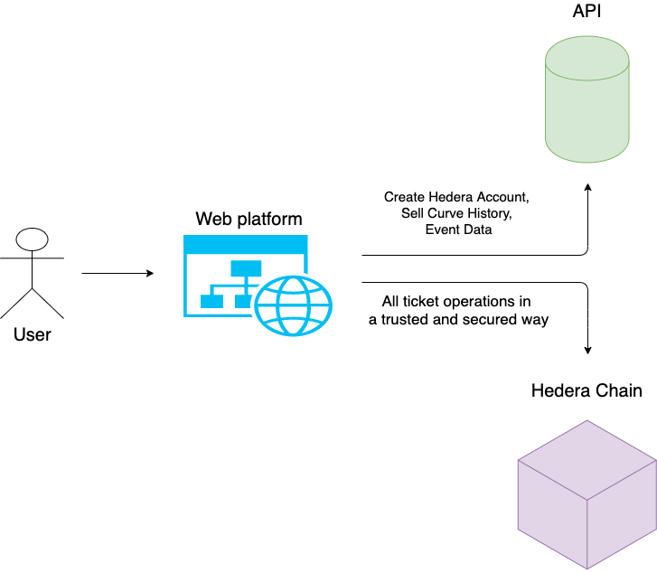

# Hedera Tickets API



### Overview
API main functionality
* Creating encrypted Hedera accounts for our users, because someone should pay the bill
* Fetching data from the contract a user should not pay for
* Sell Curve History

### Prerequisites
1. Install mongoDB
2. Start it - ` mongod --dbpath ./data/
`
### Start

**Start the API first** - https://github.com/LimeChain/hedera-tickets-backend
```
npm install 

// Build the API 
npm run build

// Start the API
npm run watch
```
